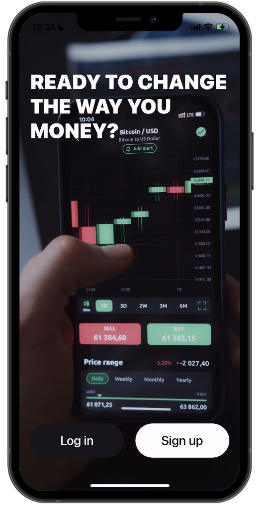
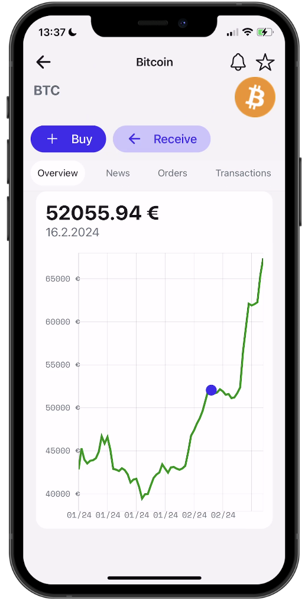

# React Native - FinTech Clone - Autenticação com Clerk

- [Expo Router](https://docs.expo.dev/routing/introduction/) Navegação e API Routes.
- [SMS OTP](https://clerk.com/docs/custom-flows/email-sms-otp?utm_source=sponsorship&utm_medium=github&utm_campaign=simong&utm_content=rn-fintech) Autenticação com Clerk
- [Reanimated](https://docs.swmansion.com/react-native-reanimated/) animações
- [Gesture Handler](https://docs.swmansion.com/react-native-gesture-handler/) gestures
- [Zustand](https://zustand-demo.pmnd.rs/) and [MMKV](https://github.com/mrousavy/react-native-mmkv) estados
- [Victory Native XL](https://commerce.nearform.com/open-source/victory-native) Gráficos
- [Zeego](https://zeego.dev/start) para menus nativos
- [CoinMarketCap API](https://coinmarketcap.com/api/documentation/v1/) api de ativos bitcoin/ethereum etc...

## Screenshots

